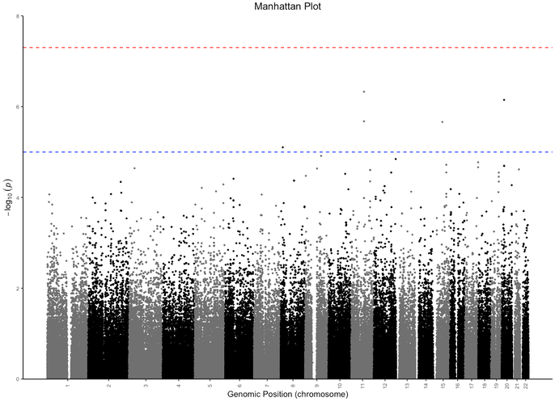
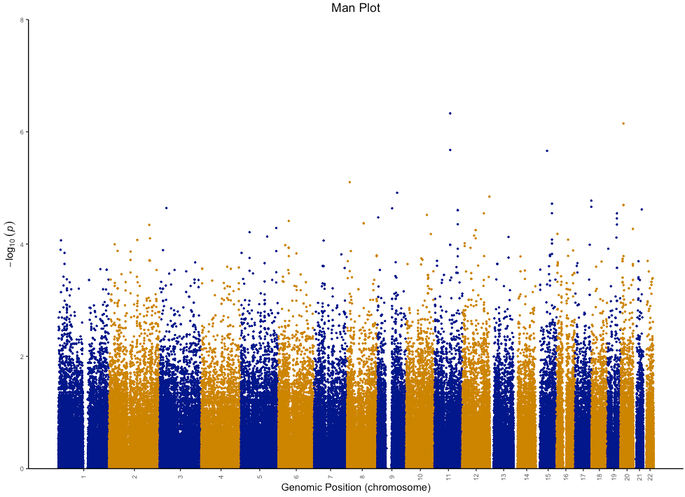
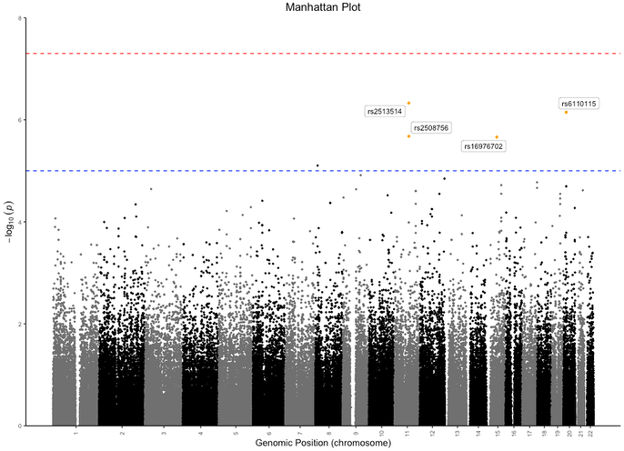
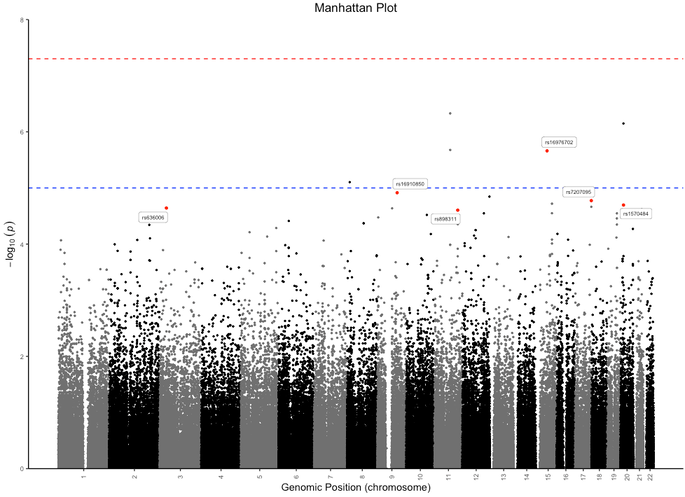
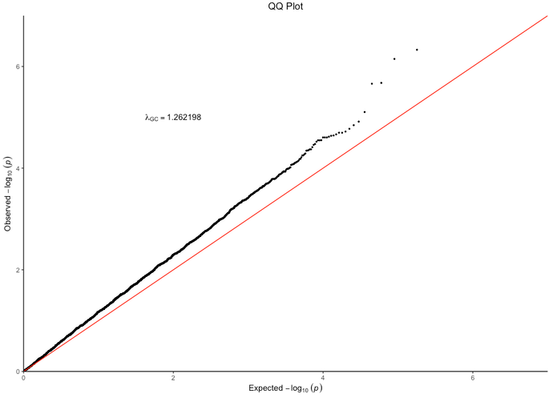
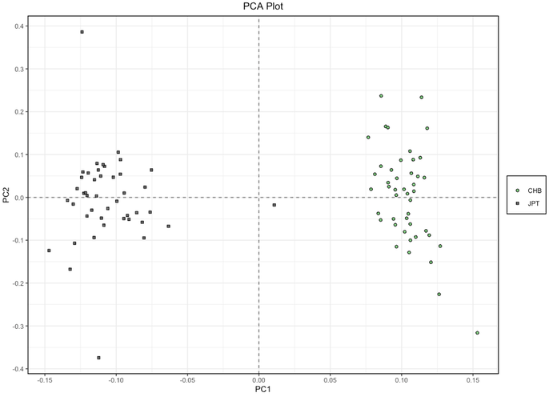
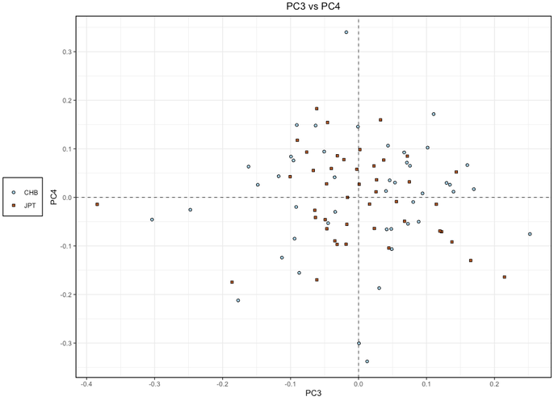

```{r, include = FALSE}
knitr::opts_chunk$set(
  collapse = TRUE,
  comment = "#>"
)
```

```{r setup}
library(gwaRs)
```

# Introduction to the **gwaRs** package

## 1. Example data

The **gwaRs** package includes functions for creating: (1) Manhattan and Q-Q plots from GWAS results; and (2) PCA plots from PCA results. The `gwasData` data.frame included with the package has example GWAS results for 179,493 SNPs on 22 chromosomes. The The `pcaData` data.frame has 89 samples and 20 eigenvalues for each sample. Take a look at the data:

### 1.A `gwasData`

```r
head(gwasData)
```

```
   CHR        SNP      BP A1     F_A     F_U A2  CHISQ      P     OR
1:   1  rs3094315  792429  G 0.14890 0.08537  A 1.6840 0.1944 1.8750
2:   1  rs4040617  819185  G 0.13540 0.08537  A 1.1110 0.2919 1.6780
3:   1  rs4075116 1043552  C 0.04167 0.07317  T 0.8278 0.3629 0.5507
4:   1  rs9442385 1137258  T 0.37230 0.42680  G 0.5428 0.4613 0.7966
5:   1 rs11260562 1205233  A 0.02174 0.03659  G 0.3424 0.5585 0.5852
6:   1  rs6685064 1251215  C 0.38540 0.43900  T 0.5253 0.4686 0.8013
```

```r
tail(gwasData)
```

```
   CHR       SNP       BP A1     F_A     F_U A2   CHISQ       P     OR
1:  22 rs6151429 49353621  C 0.04167 0.02439  T 0.40530 0.52440 1.7390
2:  22 rs6009945 49379357  C 0.28120 0.46340  A 6.33100 0.01187 0.4531
3:  22 rs9616913 49405670  C 0.14580 0.06098  T 3.34000 0.06762 2.6290
4:  22  rs739365 49430460  C 0.45830 0.35370  T 2.00300 0.15700 1.5460
5:  22 rs6010063 49447077  G 0.42710 0.46340  A 0.23650 0.62680 0.8632
6:  22 rs9616985 49519949  C 0.03125 0.03659  T 0.03865 0.84410 0.8495
```

### 1.B `pcaData`

```r
head(pcaData)
```

```
    V1      V2        V3         V4         V5         V6          V7         V8         V9        V10        V11
1: CHB NA18526 0.1021620 -0.0802695 -0.1175090  0.0435543  0.00398304  0.0701086  0.0464041  0.0828898  0.0233586
2: CHB NA18524 0.1159210  0.0462588  0.1016290  0.1024390  0.08276540  0.0487820  0.0432661  0.1950300  0.2325210
3: CHB NA18529 0.1035350 -0.0486933 -0.0505614  0.0942688  0.03805160  0.0563719 -0.0683714 -0.0130493  0.0208264
4: CHB NA18558 0.0856630  0.2369130  0.0671311  0.0925527  0.09222490 -0.0362263  0.3114080 -0.0410947  0.2180270
5: CHB NA18532 0.0994843  0.0868266 -0.0940931 -0.0849465  0.08330130 -0.1718800  0.0296239 -0.0176911  0.0981263
6: CHB NA18561 0.1170740 -0.0780894  0.0489280 -0.1065820 -0.14925700  0.1557580  0.1858770 -0.0760417 -0.1083460
          V12        V13          V14         V15         V16        V17         V18         V19        V20
1: -0.0559799  0.1788920 -0.000688469  0.06752420  0.07811050 -0.0226015  0.20033900  0.04568660  0.0336244
2:  0.0121295 -0.2013410  0.077125300 -0.00243438  0.23360400  0.2268170 -0.07663490  0.00644756 -0.0310955
3:  0.0337496  0.1621830  0.074122200 -0.02600130 -0.00319425  0.0532833  0.17227600 -0.01104990 -0.0399919
4:  0.0638962 -0.0543214  0.065519000  0.16062200 -0.02528600  0.0337762  0.11059100 -0.02698640 -0.1621610
5:  0.0705554  0.1054110 -0.175174000  0.11226400 -0.10821300  0.1744200 -0.18048100  0.02727720  0.0596685
6: -0.0979118  0.1824230 -0.148591000 -0.17594500  0.17813900  0.1732660  0.00318751 -0.19459100 -0.1230800
           V21        V22
1: -0.00833644  0.0131147
2: -0.18368500 -0.1209090
3:  0.24053500  0.0228002
4:  0.27951200  0.2174900
5:  0.00733837 -0.1272560
6: -0.08097990  0.0168803
```

```r
tail(pcaData)
```

```
    V1      V2         V3          V4          V5         V6          V7          V8           V9         V10
1: JPT NA18998 -0.1341370 -0.00684702  0.02648860  0.0361811  0.01006460 -0.12428400 -8.05897e-05 -0.06494070
2: JPT NA19000 -0.1273780  0.02050720  0.00204791  0.0983349  0.00327401  0.00202355 -6.71315e-03 -0.05049620
3: JPT NA19005 -0.0817858 -0.05797780 -0.02154850  0.0777595  0.01300850  0.04618270  6.97462e-02 -0.01127060
4: JPT NA18999 -0.1091960  0.07656090 -0.18612700 -0.1745370 -0.24334100  0.00346269  1.24032e-01  0.01317670
5: JPT NA19007 -0.0944116  0.01029870  0.11444800 -0.0141372 -0.05771370 -0.19853500 -2.35007e-02  0.00712097
6: JPT NA19003 -0.1239330  0.38619200 -0.38445800 -0.0144185  0.04296190 -0.01776520 -2.35986e-01 -0.08887380
          V11        V12        V13        V14        V15        V16         V17        V18        V19        V20
1:  0.0540273 -0.1585970  0.1849220  0.0428487  0.0185219 -0.0761500 -0.05062780  0.0706693 -0.0228829  0.1067870
2: -0.0585140  0.0478342 -0.0490029 -0.0155314  0.0633804 -0.0908284 -0.04767790 -0.0057602  0.0290054  0.1484800
3: -0.0597138 -0.0216306 -0.0223577  0.0629585 -0.0512563  0.0541781 -0.02620120 -0.0475181  0.1207370  0.0931941
4: -0.0849584  0.1531680 -0.1525280  0.0495856  0.0829920  0.0563818  0.06968250  0.0815255  0.2290310 -0.2646310
5: -0.0856837 -0.1907780  0.0512221  0.1912130 -0.0679721 -0.0429544  0.08268860  0.1785510  0.2326160  0.1290180
6:  0.1032770 -0.0346665 -0.1253720 -0.1068850 -0.2154660  0.0517122 -0.00279075  0.2537610 -0.1343860  0.0451126
           V21        V22
1: -0.11810800 -0.0207741
2: -0.05718480  0.0760405
3: -0.00467034 -0.0146390
4: -0.03763110 -0.1481140
5:  0.00592505  0.0479006
6: -0.22849800  0.1155260
```

## 2. Manhattan plots

### 2A. Basic Manhattan plot
Create a basic Manhattan plot. 

```r
man_plot(gwasData)
```



### 2B. Change graphical parameters
We can also pass in other graphical parameters. Let's add a title (`title=`), change the chromosome colors (`chromCol=`), and remove the suggestive and genome-wide significance lines:

```r
man_plot(gwasData, title = "Man Plot", chromCol = c("blue4", "orange3"),
    genomewideline = F, suggestiveline = F)
```



### 2C. Annotate SNPs by p-value
We can also annotate SNPs by passing a p-value threshold using (`annotatePval=`) and choosing the point color for annotated SNPs using (`annotateCol=`)

```r
man_plot(gwasData, annotatePval = 0.000005, annotateCol = "orange")
```



### 2D. Annotate SNPs by rsids
We can also annotate SNPs by passing a character vector containing rsids using (`annotateSNP=`) and choosing the point color for annotated SNPs using (`annotateCol=`)

```r
man_plot(gwasData, annotateSNP = c("rs636006", "rs1570484", "rs16976702", "rs898311", "rs16910850", "rs7207095"),
         annotateCol = "red")
```



### 2E. Highlight SNPs by rsid
We can also highlight SNPs by passing a character vector containing rsids using (`highlight=`) and choosing the point color for highlighted SNPs using (`highlightCol=`)

```r
head(highlightSNPS)
```

```
[1] "rs636420"   "rs12221774" "rs4477460"  "rs4639959"  "rs4945035"  "rs10899166"
```

```r
man_plot(gwasData, highlight = highlightSNPS)
```


### 2F. Looking at a single chromosome
We can also look at a single chromosome passing an integer indicating which chromosome to plot using (`chromosome=`).

```r
man_plot(gwasData, chromosome = 1)
```


## 3. Q-Q plots
To create a Q-Q plot, simply supply a PLINK assoc output, tab-delimited, or a data.frame with "P" column to the qq_plot() function.

```r
qq_plot(gwasData)
```



You can also change many other graphical parameters.

```r
qq_plot(gwasData, title = "GWAS Q-Q Plot", point_col = "blue",
    diag_col = "black", diag_line = "dashed")
```


## 4. PCA plots
To create a PCA plot, simply supply PLINK pca output, or EIGENSTRAT smartpca output, or any tab-delimited file or data.frame with the same format as PLINK pca or EIGENSTRAT smartpca output.

```r
pca_plot(pcaData)
```



You can also change many other graphical parameters like the x- and y-axis component using (`xComponent=` and `yComponent=`) respectively. You can also change the legend position using (`legendPos=`), color palette using (`colPalette=`), title using (`title=`)

```r
pca_plot(pcaData, xComponent = "PC3", yComponent = "PC4", legendPos = "left",
         colPalette = "Paired", title = "PC3 vs PC4")
```


